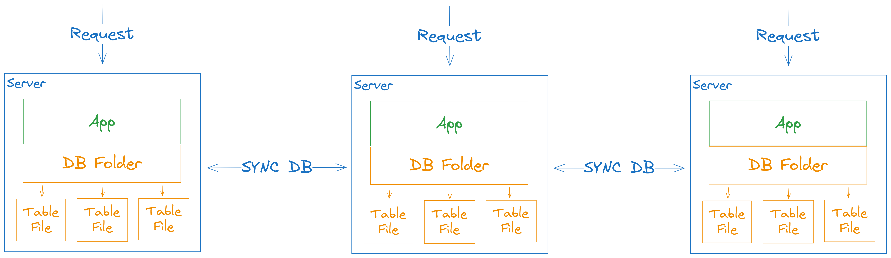
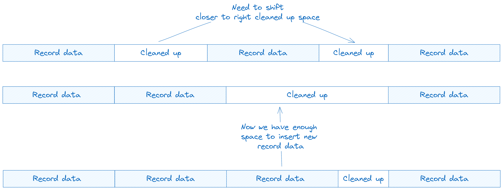

# Database

I am experimenting with creating a database. It will be based around embedded
replicas, horizontal scaling and having direct access to data from programming
language instead of separate query language.

Don't have particular name for it, here are couple ones:

- Unator DB
- Folder DB
- Embedded DB

Other databases, which inspire creation:

- [Turso](https://turso.tech/)
- [SpacetimeDB](https://spacetimedb.com/)

## Overview

Singe instance of server with experimental database:

As you can see, your application logic and database logic are combined into 1
server. It allows to not have a Query Language layer as well as network overhead.

## Horizontal Scaling

Because our database is based around embedded model, we must handle horizontal
scaling on database level.

Keep in mind that it's possible to not have embedded database, but just send
request to the server that has one. But let's not care about it for now.

Here is simple scheme for you:

### Data synchronization

This is problem I bring with database design. I'm confident we can find a
solution since others have resolved similar problems.

Synchronization is about mutations, because queries don't change anything.
Certain mutations don't conflict between each other: changes in different tables,
update + delete (delete wins anyway).

But of course there are problems. For example, 2 updates on the same record
on the same field.

So first thing we can introduce is marking each mutation with _UTC Time_. So
we can sort and sync operations based on time. But what if operations happen
at the same time? Such situation may appear, because we have different servers.

So we need some decentralized way to difine which operations should win. And I
have maybe crazy idea, but in such case, where 2 updates happen on the same
record, on the same field, at the same time, we will just compare the serialized
data like we compare strings and difine order from it.

I just don't see or know better solution. This one is pretty fine, and it will
happen super reraly. Most of the time _UTC Time_ of record will be enough and
fair determination of priority.

But I think we may introduce some flag to mark certain operation as _Important_,
so it will win without string-like comparison, if operations happen at the same
time. But it may be overhead.

## Storing data

I don't plan to keep all data in memory, because it's too expensive.
Of course, if you have certain requirments, you could store whole db
inside of RAM.

But for most of edge applications it's not required. Maybe I will support it
as an optional, but for now I will focuse on how to store it on the disk.

Because even if all our data is in RAM, we still need optimized way to
back up it into file system to not loose data after redeploy.

During UPDATE or DELETE shifting of data to right or left is too expensive.
Because number of bytes to shift may be really big. Imaging shifting 2GB!

So I want to just mark space as "Cleaned up" and than later shift it by small
steps, so we can space for new records:

With such model we _MUST NOT EXPECT_ that queried data will have the same order
as we added it. Because if new record is small enough to be inserted into
"Cleaned up" space, then it will be.
