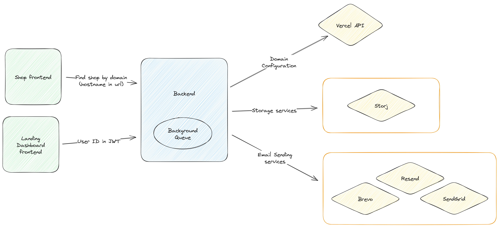

# Spentoday

Unator as a library was born during development of [Spentoday](https://www.spentoday.com/).

Spentoday is E-commerce platform for Ukrainian market. User is able to create a shop with free domain or custom one. All shops are separated from each other, so it's more like Shopify rather than marketplace.

## Architecture

In our case Spentoday had a C# ASP.NET Core backend and 2 SvelteKit frontends.
And because we needed to start without spending as little as possible, I designed switches:

- [Email switch](../switches/email.md) to use several email services
- [Storage switch](../switches/storage.md) to use several storages in future
`